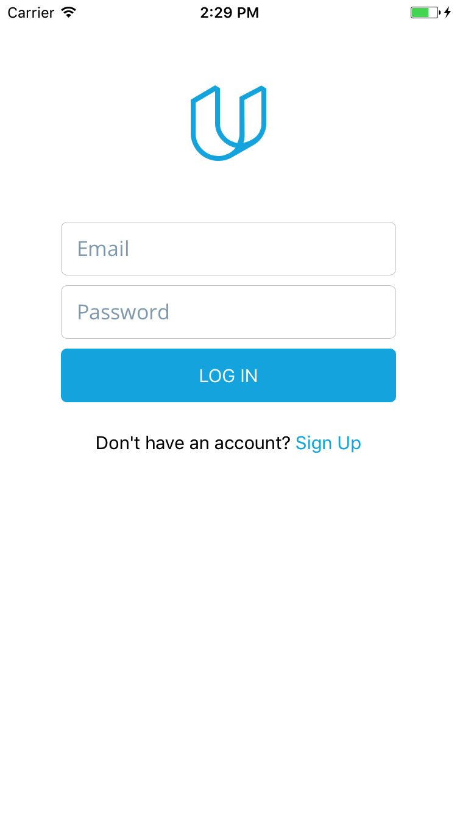
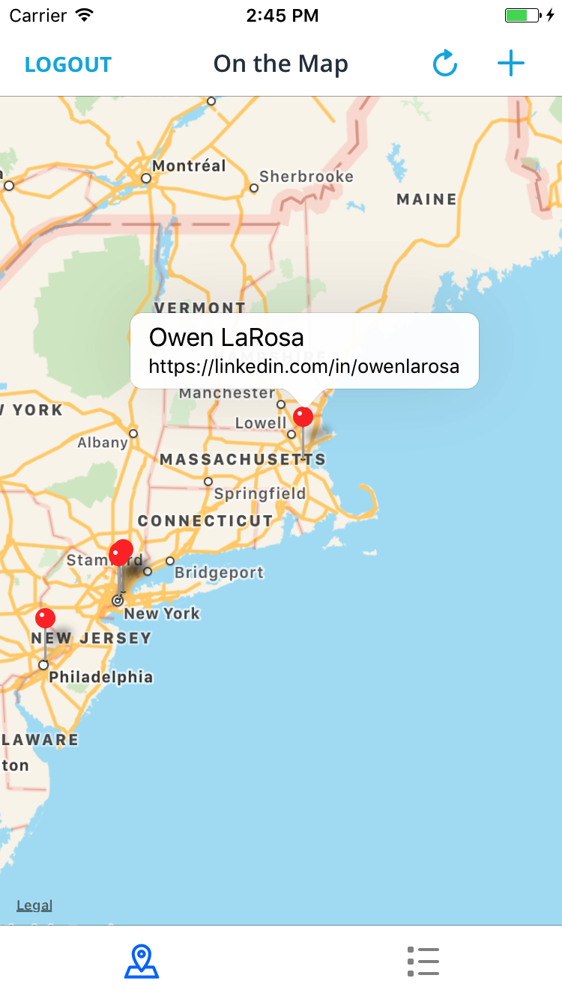
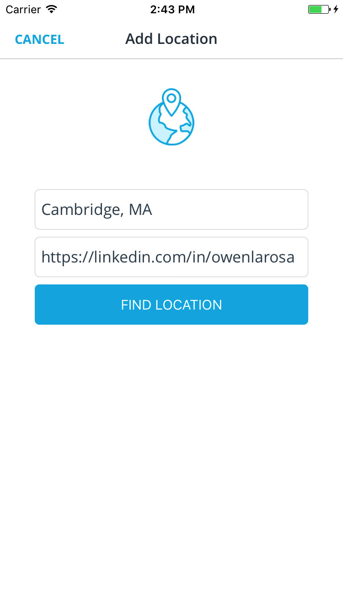
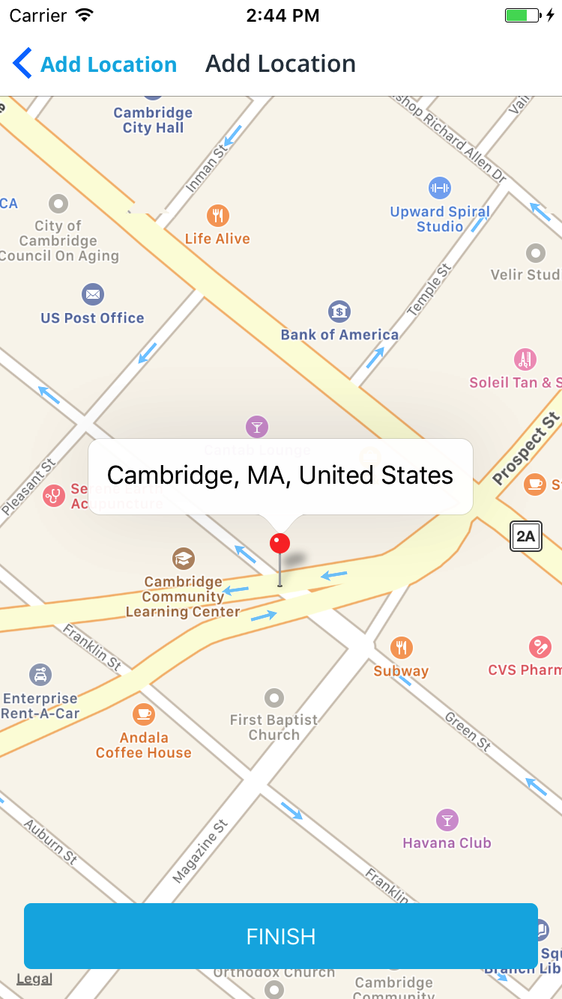

The On The Map app allows users to share their location and a URL with their fellow students. To visualize this data, On The Map uses a map with pins for location and pin annotations for student names and URLs, allowing students to place themselves “on the map,” so to speak. 

First, the user logs in to the app using their Udacity username and password. After login, the app downloads locations and links previously posted by other students. These links can point to any URL that a student chooses. We encourage students to share something about their work or interests.

After viewing the information posted by other students, a user can post their own location and link. The locations are specified with a string and forward geocoded. They can be as specific as a full street address or as generic as “Costa Rica” or “Seattle, WA.”

The app has three view controller scenes:

Login View: Allows the user to log in using their Udacity credentials, or (as an extra credit exercise) using their Facebook account
Map and Table Tabbed View: Allows users to see the locations of other students in two formats.  
Information Posting View: Allows the users specify their own locations and links.

These three scenes are described in detail below.

Login View

The login view accepts the email address and password that students use to login to the Udacity site. User credentials are not required to be saved upon successful login.

When the user taps the Login button, the app will attempt to authenticate with Udacity’s servers.

Clicking on the Sign Up link will open Safari to the Udacity sign-up page.

If the connection is made and the email and password are good, the app will segue to the Map and Table Tabbed View.

If the login does not succeed, the user will be presented with an alert view specifying whether it was a failed network connection, or an incorrect email and password.

Map And Table Tabbed View

This view has two tabs at the bottom: one specifying a map, and the other a table.

When the map tab is selected, the view displays a map with pins specifying the last 100 locations posted by students.

The user is able to zoom and scroll the map to any location using standard pinch and drag gestures.

When the user taps a pin, it displays the pin annotation popup, with the student’s name (pulled from their Udacity profile) and the link associated with the student’s pin.

Tapping anywhere within the annotation will launch Safari and direct it to the link associated with the pin.

Tapping outside of the annotation will dismiss/hide it.

When the table tab is selected, the most recent 100 locations posted by students are displayed in a table. Each row displays the name from the student’s Udacity profile. Tapping on the row launches Safari and opens the link associated with the student.

Both the map tab and the table tab share the same top navigation bar.

The rightmost bar button will be a refresh button. Clicking on the button will refresh the entire data set by downloading and displaying the most recent 100 posts made by students.

The bar button directly to its left will be a pin button. Clicking on the pin button will modally present the Information Posting View.

Information Posting View

The Information Posting View allows users to input their own data.

When the Information Posting View is modally presented, the user sees two text fields: one asks for a location and the other asks for a link.

When the user clicks on the “Find Location” button, the app will forward geocode the string. If the forward geocode fails, the app will display an alert view notifying the user. Likewise, an alert will be displayed if the link is empty.

If the forward geocode succeeds then text fields will be hidden, and a map showing the entered location will be displayed. Tapping the “Finish” button will post the location and link to the server.
If the submission fails to post the data to the server, then the user should see an alert with an error message describing the failure.
If at any point the user clicks on the “Cancel” button, then the Information Posting View should be dismissed, returning the app to the Map and Table Tabbed View.

Likewise, if the submission succeeds, then the Information Posting View should be dismissed, returning the app to the Map and Table Tabbed View.
Simulator Screen Shot - iPhone 7 - 2017-10-06 at 14.44.07.png

